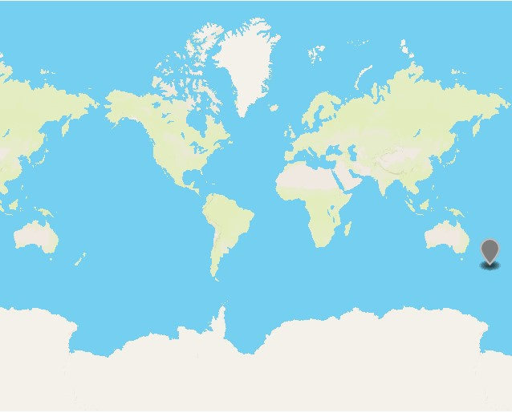
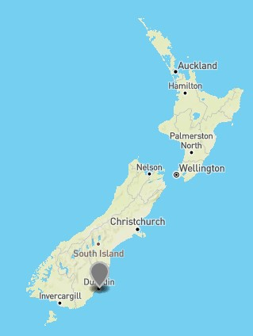
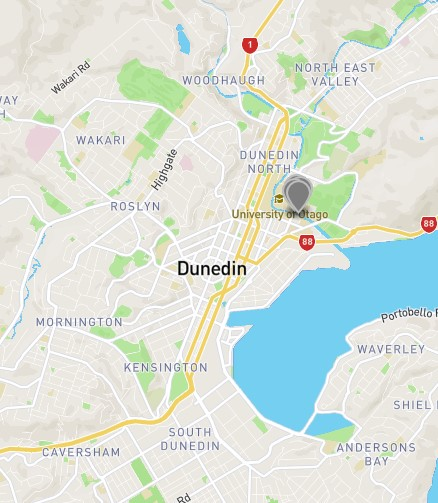
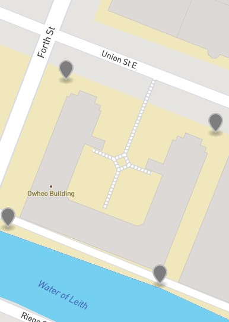

# CoordParsing Report

## Author: Hayden McAlister 1663787

## Plan
In this project, we want to take user input, convert the input to a standard coordinate form, then put these coordinate pairs into a geoJSON format.

## Getting user input
### Forms of Input
Users should be able to give our program input. We shall support two forms of input, from `stdin` in the terminal or from a file. Because our users cannot be trusted, and could put anything they want into this input, we will need to sanitize the input. In order to do this, we will have to ensure we are dealing with a single input at a time, so we will restrict the user to putting a single coordinate candidate on each line. This assumptions gives us a starting point to get the users input.

### Sanitization plan
Since the user could give our program anything at all, we need to check the format of what we are given in order to start working with it. If the input is the entire work of Shakespeare, it would be difficult to parse this into coordinates. So, we will accept only certain formats and discard all others. To accept input strings of a certain format, we will use regular expressions, which match strings based on the characters in them. While these can be slow, they are exceptionally powerful and will allow us to easily match the inputs to formats specified by the regex. 

### Acceptable formats
We must choose the acceptable input formats for our program. Since we are to convert inputs into coordinates, it would be wise to look at the different representations of coordinates[1]. We will accept standard form (as we are going to output standard form anyway), where we are given latitude in a range of [-90, 90] degrees, and longitude in a range of [-180, 180] degrees, and each coordinate is given with six decimal places of precision. We will also accept close relatives of standard form, such as with different precision in the decimal place, or with no decimal place at all. We will also accept numbers from outside the ranges specified, and deal with the ranges later. We will also accept coordinates in a form that specified a direction (N/S, W/E), as this can be easily converted to standard form as well.

Outside of standard form, we will accept sexagesimal degree (or degrees, minutes, seconds) again with or without the NSWE direction indicators. We will also accept some different degree/minute/second markers (such as accepting the prime ′ or single quote \' for minutes), or accept no indicator at all in order to catch as many possible coordinates as possible. We will also accept degrees with decimal minutes, again with or without NSWE and different markers.

Finally, we will accept a variety of separators between the two coordinates in a pair, as well as some extra whitespace within the coordinates, to be as inclusive as possible.

### Implementation
To catch this wide range of possible inputs, the first stage in the `parse_coord_candidate` function (see `CoordParsing.py`) is to strip whitespace and convert the candidate to uppercase (for the NSWE direction indicators). Then, we test the string against regex which represents each case we are looking for. The cases we have used are:

* `Standard Form Catch All`
For any input which looks like a number with or without decimals
* `Standard Form NSWE`
For anything looking like a number with a NSWE direction indicator
* `Degree Minute Second`
For any three numbers which can be interpreted as degrees, minutes, and seconds
* `Degree Decimal Minute`
For any two numbers which can be interpreted as degrees with decimal minutes

We also accept the separators of:
* ""
The nothing separator, hopefully with some spaces around it
* ","
A lovely comma
* ";"
The formal semicolon

Separators can also have as many spaces around them as the user inputs, these will be stripped later.

If the candidate string matches to any regex, we now have a format that we can work with and can move on to parsing the input. If no regex is matched, then we can tell the user the input is invalid.

## Parsing the data
Now that we have the input in a form that is known (by matching regex) we can easily parse it. The first step in each case is to split the candidate string and remove the separator, as well as the whitespace around each coordinate in the pair. While parsing, our program may make some changes to the user data as a "best guess" to be more inclusive (such as swapping the order of a pair to ensure coordinates are in a valid range). Now that we have individual strings for each coordinate, let's look at each case individually.

### `Standard Form Catch All`
First, check if latitude is in range, and if it isn't then see if we can swap it with longitude to get a valid coordinate pair, and update the message string to tell the user what we have done. If we can't, raise an error and give up. Latitude out of range could technically be fixed by modulo 90 (like longitude, see below) but would involve changing the sign on the longitude to do so, which may cause confusing errors to the user and would be more trouble than it is worth. It is better to just tell the user the data is incorrect than to try and fix it for them and cause more headaches.

If the longitude is out of range, we can still fix this. Since shifting longitude to be in range won't affect latitude, we will just shift it and update the message string to reflect this.

Finally, we can very simply format our output string to have six decimal places and a standard separator and we are done!

### `Standard Form NSWE`
First, ensure the given directions are unique (i.e. we can't work with the user giving us two coordinates that both point north). Throw an error if they aren't unique.

Swap coordinates around if they are out of order (update the message string of course), and split out the direction and the value.

Do a separate check for latitude here, as if the latitude is out of range then the user very consciously gave us invalid data. Swapping it with the given longitude could cause massive confusion as we would be swapping values but not directions and this isn't worth it.

Now, convert the given direction to a negative if necessary, and we have two numbers again! Give these two numbers to the `standard form catch all` parser and we are done.

### `Degree Minute Second`
Let's do the same direction indicator check as above, assuming N and E if no directions are given.

Then we will split out the values only, and convert them into decimal degree forms[2]. 

Now we have decimal degrees with direction indicators, so we can parse this through `Standard Form NSWE`.

### `Degree Decimal Minute`
Just as before, do a direction indicator check and assume N and E if none given.

Split out the values only and convert to decimal degrees [2].

We again have decimal degrees with direction indicators, so we can parse this through `Standard Form NSWE`.

## Standard Form to geoJSON
We have now successfully parsed the user input to a standard form string (or told the user that we couldn't do so by error message). Next up, we take the standard form result and put it into a geoJSON `feature` object, and enumerate this point in its `name` property.

Finally, after parsing all the user data, we put all out geoJSON `feature` objects into a single geoJSON `FeatureCollection` and save this object to a file (`data_file.geojson`).

## Visualizing Success
We have decided to simply export a geoJSON objet and let the user use their own tools to visualize this. Mainly, this is because this project was done in python, and the geo visualization library `geopandas` and `geoplot` can be extremely dramatic and tedious (on windows at least). To ensure that the program can be used by everyone (and not just people who can debug `pip` error messages), it was decided to recommend `https://geojson.io/` instead.
As a test of the program, let's take a set of test inputs:
* `-45.866745, 170.517932`
* `45.867208 S, 170.517669 E`
* `-45° 52.04322', 170° 31.10136'`
* `-45° 52' 0.8796", 170° 31' 6.9888"`

And have a look at our output using `https://geojson.io/`

Right on target.

## References
[1] https://en.wikipedia.org/wiki/Geographic_coordinate_system

[2] https://en.wikipedia.org/wiki/Geographic_coordinate_conversion#Change_of_units_and_format